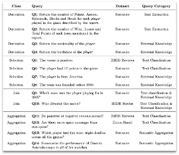

# Semantic Query Engines -- Experimentation Suite

In this project we conduct an experimetation suite to evaluate Semantic Query Engines and their capabilities to perform semantic operations over both structured and unstructured data.
The systems that this experimentation suite aims to evaluate are Lotus, Palimpzest, BlendSQL and ELEET over a common set of 14 queries covering a wide range of question categories and utilizing a set of four different datasets, as depicted in the following table:




Our suite consists of query scripts per query for Lotus, BlendSQL and Palimpzest, and the corresponding evaluation scripts for all the systems.
Query scripts are divided into four categories: projection, selection, join and aggregation.
Note that not every system can handle all queries.
Additionally, for each query there is a bash script for creating different experimental runs, alternating different variants (i.e., the model, the provider and the input size).
A similar structure is also followed for the evaluation.

In order to reproduce all experiments per system, the first step is to create the corresponding virtual enviroment.
Therefore, each system comes with a `enviroment.yml` file, and the conda enviroment manager is required.

The steps to create an enviroment and run a query is the following:

```
conda env create -f environment.yml
conda activate palimpzest
./palimpzest/queries/projection/Q1/runs.sh
```

Similarly all experimental run can be reproduced.
